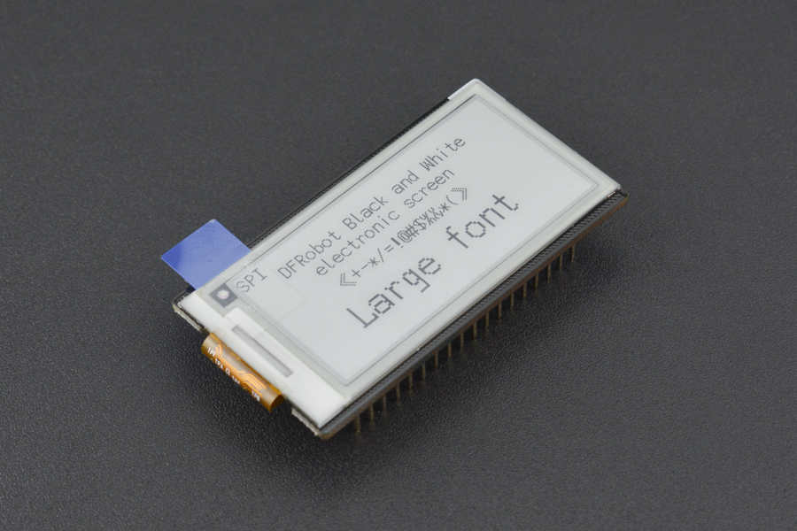
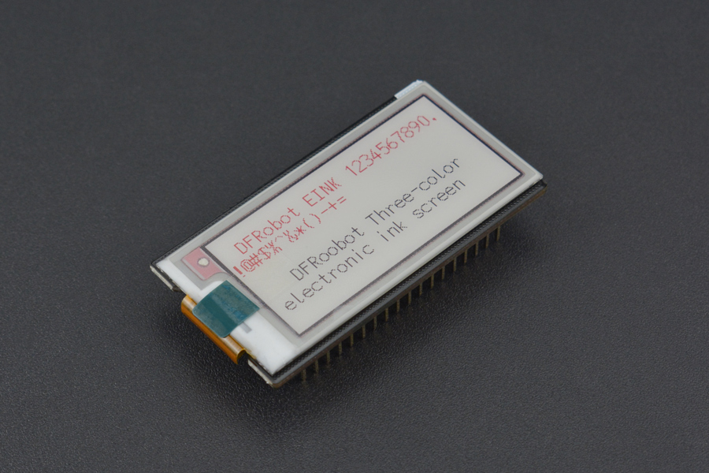

# DFRobot_ePaper
- [中文版](./README_CN.md)

DFRobot FireBeetle series is low-power development component designed for Internet of Things(IoT). This FireBeetle Covers-ePaper <br>
Black&White&Red Display Module(SPI) features a 2.13-inch electronic ink screen with 212x104 resolution and SPI interface, <br>
supporting Arduino library and microPython programming. This module is suitable for the current main control board of Firebeetle <br>
series. It has the characteristics of small size, compact layout, plug and play, low power consumption and good display effect. <br>
Compared with the traditional electronic ink screen it displays better and it integrates the GT30L24A3W/foreign language font chip. <br>
But compared with the traditional black-and-white electronic ink screen within 1s refresh speed, this screen refresh speed is relatively <br>
slow (at least once 12s). And it only suitable for static pictures or text display, but not for dynamic refresh.<br>
Note: This board is only available for ESP32 and ESP8266, but not for FireBeetle BLE4.1 <br>




## Product Link（https://www.dfrobot.com）
    DFR0531: ePaper Black&White&Red Display Module - FireBeetle Covers (Discontinued)
    DFR0511: FireBeetle Covers-ePaper Black&White Display Module
## Table of Contents

* [Summary](#summary)
* [Installation](#installation)
* [Methods](#methods)
* [Compatibility](#compatibility)
* [History](#history)
* [Credits](#credits)

## Summary

It provides an Arduino library to control 4 types of e-link display screen.  
The library compromises 4 drive modes of two epapers, including IIC drive, SPI drive of both Black & White epaper and Tricolor epaper.

## Installation
To use this library, please download the library file first, and paste it into the \Arduino\libraries directory, then open the examples folder and run the demo in the folder.
 注意：本库需要配合DFRobot_Display使用，确保安装了DFRobot_Display后再使用本库
## Methods


```C++

  /**
   * @fn begin
   * @brief 初始化屏幕
   * @param busy Select I2C busy pin
   */
  void begin(const char busy);
  /**
   * @fn standby
   * @brief 是屏幕进入standby模式
   */
  void standby();

  /**
   * @fn wakeUp
   * @brief 唤醒屏幕
   */
  void wakeUp();

  /**
   * @fn fillRect
   * @brief Fill the rectangle
   * @param x 矩形起点x坐标
   * @param y 矩形起点y坐标
   * @param width 矩形的宽度
   * @param height 矩形的高度
   * @param color WHITE RED BLACK
   */
  void fillRect(int16_t x, int16_t y, int16_t width, int16_t height, uint16_t color);

  /**
   * @fn fillCircle
   * @brief Fill the circle 
   * @param x0 圆心的x坐标
   * @param y0 圆心的y坐标
   * @param r 圆的半径
   * @param color WHITE RED BLACK
   */
  void fillCircle(int16_t x0, int16_t y0, int16_t r, uint16_t color);

  /**
   * @fn flush
   * @brief Refresh screen 
   * @return None
   */
  void flush();

  /**
   * @fn flush
   * @brief Refresh screen 
   * @param mode PART：局部刷新模式,FULL全屏刷新模式
   * @return None
   */
  void flush(uint8_t mode);

  /**
   * @fn drawPicture
   * @brief 显示图片（212*104），可以是红色、黑白、红白黑三色图片。
   * @param pic_bw 黑白图片。
   * @param pic_red 红色图片。
   */
  void drawPicture(const unsigned char *pic_bw, const unsigned char *pic_red);

  /**
   * @fn drawPicture
   * @brief 显示图片（212*104），可以是红色、黑白、红白黑三色图片。
   * @param pic_bw_3895 黑白图片
   */
  void drawPicture(const unsigned char *pic_bw_3895);

  /**
   * @fn fillScreen
   * @brief 填充屏幕
   * @param color WHITE RED BLACK
   */
  void fillScreen(uint16_t color);

  /**
   * @fn drawPixel
   * @brief 在屏幕上画点
   * @param x 点的x坐标
   * @param y 点的y坐标
   * @param color WHITE RED BLACK
   */
  void drawPixel(int16_t x, int16_t y, uint16_t color);

  /**
   * @fn disString
   * @brief Displays a string
   * @param x 字符串起始x坐标
   * @param y 字符串起始y坐标
   * @param size 字符串的大小
   * @param ch 字符串内容
   * @param color WHITE RED BLACK
   */
  void disString(uint8_t x, uint8_t y, uint8_t size, char *ch, uint8_t color);

```

## Compatibility

FireBeetle Covers-ePaper Display Module(SPI):

MCU                | Work Well | Work Wrong | Untested  | Remarks
------------------ | :----------: | :----------: | :---------: | -----
FireBeetle-ESP32  |      √       |             |            | 
FireBeetle-ESP8266  |      √       |             |            | 
FireBeetle-BLE4.1 |              |      √      |            | 
Arduino uno |              |      √      |            | 
Arduino leonardo |              |      √      |            | 

FireBeetle Covers-ePaper Display Module(I2C):

MCU                | Work Well | Work Wrong | Untested  | Remarks
------------------ | :----------: | :----------: | :---------: | -----
FireBeetle-ESP32  |      √       |             |     Picture fetching       | 
FireBeetle-ESP8266  |      √       |             |            | 
FireBeetle-BLE4.1 |      √       |             | Select the "C" array           | 
Arduino uno |      √       |             |            | 
Arduino leonardo |      √       |             |            | 
 
## Tool
### Picture fetching software USES tutorials
* ``Note:`` You need an image conversion software. [Download](https://raw.githubusercontent.com/DFRobot/DFRobot_ePaper/master/tool/lcd-image-converter.zip)(lcd-image-converter)<br>
&nbsp;&nbsp;&nbsp;&nbsp;&nbsp;&nbsp;&nbsp;&nbsp;&nbsp;&nbsp;&nbsp;&nbsp;The image size of black and white epaper is 250×122.<br>
&nbsp;&nbsp;&nbsp;&nbsp;&nbsp;&nbsp;&nbsp;&nbsp;&nbsp;&nbsp;&nbsp;&nbsp;The image size of the tricolor epaper is 212×104.<br>
* `1. Open a picture“xxx.jpg”. File->Open` <br>

* `2. Set the image to flip. Image->Rotate->180` <br>

* `3. Open the output parameter Settings menu. Options->Conversion` <br>

* `4. Set the parameters as shown below.` <br>

* `5. After setting the parameters, click Show Preview`. <br>

* `6. Copy the binary in the dialog box to the array in the demo.` <br> 

* `7. Then, download the program to your development board and the image will appear on the screen.` <br> 

## History

- 2022/09/08 - Version 1.0.0 released.

## Credits

Written by fengli(li.feng@dfrobot.com), 2022.09.08 (Welcome to our [website](https://www.dfrobot.com/))
